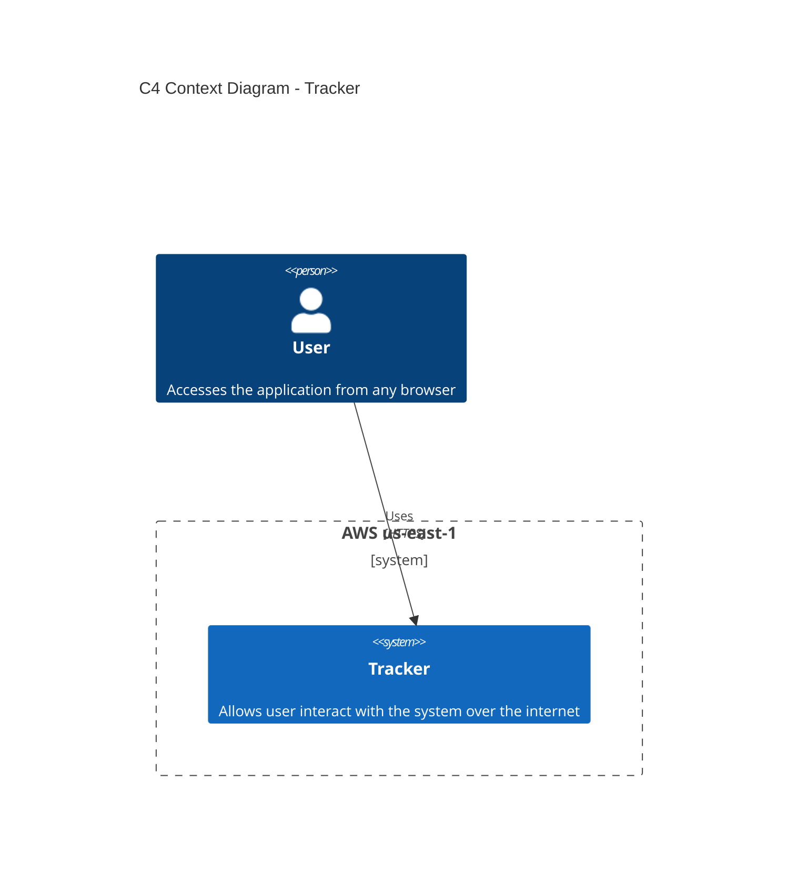

# Tracker

A simple, lightweight single-page application (SPA) for track meals, based on a serverless architecture on AWS.

## 📋 Overview

**Tracker** is a small serverless web application designed to demonstrate software engineering and cloud architecture practices using AWS-managed services.

The project focuses on keeping the architecture simple, scalable, and maintainable while following established software architecture principles.

## 🏗️ Architecture

The system architecture is documented using the **C4 Model**, progressively describing the system from its high-level context to its internal components.

### C4 Context Diagram

The Context Diagram shows Tracker as a system and its relationship with the user.



### C4 Container Diagram

The Container diagram shows the main building blocks of the Tracker system and how they communicate.


### C4 Component Diagram

Shows internal structure of containers where additional decomposition provides architectural value:

## 🧰 Technology Stack

| Layer                      | Technology         |
| -------------------------- | ------------------ |
| Frontend                   | SPA                |
| CDN                        | Amazon CloudFront  |
| Static hosting             | Amazon S3          |
| API                        | Amazon API Gateway |
| Backend                    | AWS Lambda         |
| Database                   | Amazon DynamoDB    |
| Architecture documentation | C4 Model + Mermaid |

## 🎯 Architecture Goals

The project is intentionally designed around the following principles:

* **Simplicity** — avoid unnecessary infrastructure and operational complexity.
* **Separation of concerns** — keep presentation, API, business logic, and persistence responsibilities separated.
* **Serverless-first architecture** — use managed AWS services where appropriate.
* **Scalability** — rely on managed services capable of scaling independently.
* **Maintainability** — keep the codebase and architecture easy to understand and evolve.
* **Security by design** — minimize unnecessary infrastructure exposure and access privileges.

## 🔐 Security Considerations

Security considerations are treated as part of the architecture rather than as a separate concern.

The project aims to follow principles such as:

* Least-privilege IAM permissions.
* No hard-coded credentials or secrets.
* HTTPS for client-to-API communication.
* Separation between application layers.
* Controlled access to persistent data.
* Environment-specific configuration.

## 🧪 Testing

Testing will be introduced progressively as the application evolves.

The intended testing strategy includes:

* Unit tests for business logic.
* Integration tests for application boundaries.
* API-level testing.
* End-to-end testing for critical user flows.

## 🚀 Deployment

The application is designed to be deployed using AWS managed services.

The deployment architecture separates:

* Static frontend delivery with .
* API exposure with .
* Application execution with .
* Data persistence with .

Deployment automation and infrastructure-as-code will be added as the project evolves.

## 📁 Project Structure

The repository is organized to keep application code, infrastructure, and documentation separated.

```text
tracker/
├── README.md
├── frontend/
├── backend/
├── infrastructure/
└── docs/
```

The structure may evolve as new capabilities and architectural concerns are introduced.

## 📚 Architecture Documentation

Architecture decisions and diagrams are maintained alongside the source code so that the repository provides a single place to understand how the system is designed.

Future documentation may include:

* C4 Component diagrams.
* Architecture Decision Records (ADRs).
* Deployment architecture.
* Security architecture.
* Data model documentation.
* CI/CD architecture.

## 🗺️ Roadmap

* [x] Define system context
* [x] Define container architecture
* [ ] Document backend components
* [ ] Add infrastructure as code
* [ ] Add automated tests
* [ ] Add CI/CD pipeline
* [ ] Document architecture decisions
* [ ] Improve observability and monitoring

## 📌 Project Status

This project is being developed incrementally as a practical demonstration of software engineering, cloud architecture, and AWS best practices.

The architecture and documentation will evolve together with the implementation.

## 📄 License

This project is licensed under the terms of the license included in this repository.
