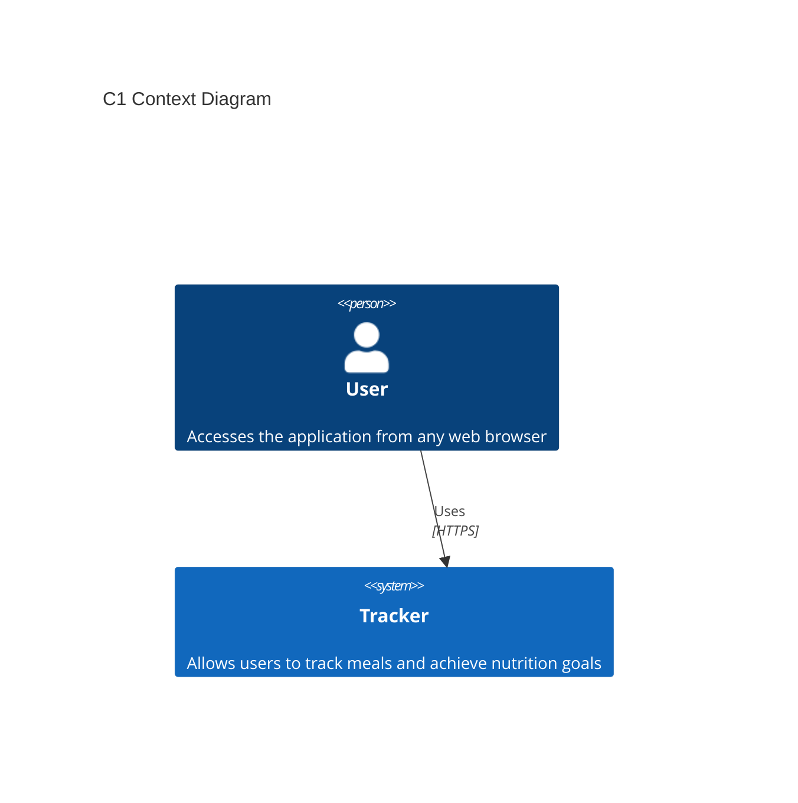
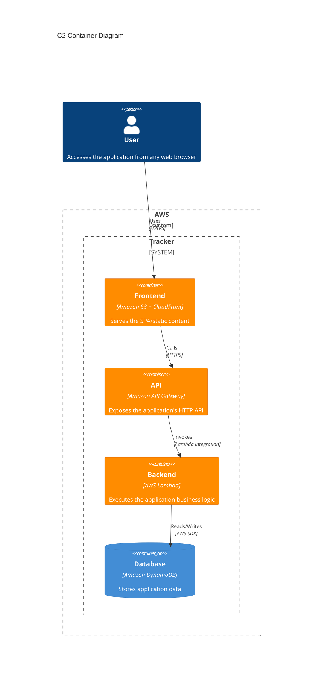
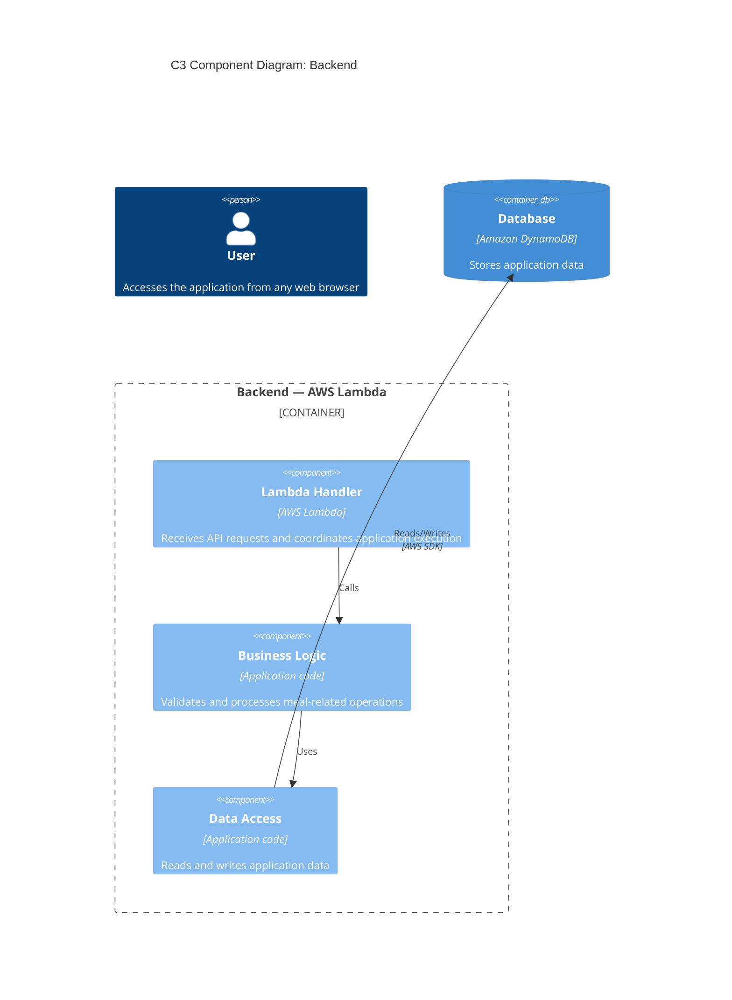

# 🎯 Tracker
A simple one click web app for tracking meals to achieve nutrition goals.

## 📋 Executive Summary
Tracker is a lightweight serverless SPA designed according to software development lifecycle (SDLC) practices, applying fundamental software engineering principles and design patterns. On well architected AWS cloud managed services.

## 📌 Status
This project is being developed incrementally to practice software engineering and cloud architecture principles.

## 📋 I. Requirements
### ⚙️ Functional Requirements
- **FR01:** Log meals with a single click.
- **FR02:** Display a week navigator.
- **FR03:** Display kcal and macros for the current date.
- **FR04:** Display **available meals** and **logged meals**.
### 🏛️ Non-Functional Requirements (architectural characteristics)
- **NFR01:** Drive scalability by utilizing managed services capable of independent growth.
- **NFR02:** Ensure high maintainability, keeping the codebase and architecture easy to understand and evolve.
- **NFR03:** Enforce security by design, applying principle of least privilege and minimize unnecessary infrastructure exposure.
### Technical decisions
- **TD01:** Add button for: Soft delete Logged meals.
- **TD02:** Add button for: Register meal in catalog.
- **TD03:** Add button for: Soft delete Available meals.
- **TD04:** 6-alphanumeric char case-insensitive ID balances clean aesthetics and security with:
 +2 billions of combinations means ~0.000056% daily collisions risk and ~0.0229% catalog collision risk.

## 🛠️ II. SecDevOps: Principles & Patterns
### 🔐 Security
Security considerations are treated as part of the design and architecture rather than as a separate concern. The project aims to follow principles such as:
* HTTPS for client-to-API communication.
* Separation between application layers.
* Controlled access to persistent data.
* No hard-coded credentials.
### 🔐 Principles
* **YAGNI:** (You Aren't Gonna Need It), **DRY:** (Don't Repeat Yourself), **KISS:** Keep It Simple, Sir.
* **SOLID Principles:** Core design principles to write clean code and maintainable software:
  * **[S]ingle Responsibility:** A module should do **only one thing**.
  * **[O]pen/Closed:** Code should be **open for extension, closed for modification**.
  * **[L]iskov Substitution:** Subclasses must be **fully interchangeable** with their parent classes.
  * **[I]nterface Segregation:** Create **small, specific interfaces** over one general-purpose one.
  * **[D]ependency Inversion:** Depend on **abstractions (interfaces)**, never on concrete implementations.
### 🔐 Patterns
* **Creational patterns:** Provide various creation mechanism increase quality of code.
* **Structural patterns:** Explain how to assemble objects and classes.
* **Behavioral patterns:** Concerned with algorithms and the responsability assignment.

## 📐 III. Software & DB Design

### 🖥️ FRONTEND Design
    Observer Design Pattern: to show changes in HEADER if logged list is modify.
#### HEADER
1. **`[ S/1 | M/2 | T/3 | W/4 | T/5 | S/6 | S/7 ]`** (**FR02:** week-nav: day of week + day of month).
2. **`[ Kcal | Prot | Carb | Fat ]`** (**FR03:** Kcal & macros for the selected date).
#### BODY
1. **`[ < Logged list > ]`** (**FR04:** Logged meals eaten).
2. **`[ < Meals list > ]`** (**FR01, FR04:** Available meals catalog, with add (+) button).

### 🗃️ API Gateway
Auth strategy:

API Version: /v1/

Contract: 
| Method | Endpoint | Description | Related FR |
| --- | --- | --- | --- |
| GET | `/meals` | Returns Available meals catalog | FR04 |
| GET | `/log?date=` | Returns Logged meals for a given date | FR03, FR04 |
| POST | `/log/{meal}?date=` | Log meal in current date | FR01 |
| PATCH | `/log/{id_log}` | Soft delete logged meal | TD01 |
| POST | `/meal/{data}` | Register meal in catalog | TD02 |
| PATCH | `/log/{id_log}` | Soft delete meal of catalog | TD03 |

### 🗄️ BACKEND Design
    S-SOLID Design Principles: Single responsibility for components and methods
    Singleton Design Pattern: Ensure single DB connections.
    
#### AWS Lambda Methods
MealService.getCatalogMeals() -> Meal[]
MealService.getLoggedMeals() -> Meal[]
MealService.createLoggedMeal(date,{meal}) -> LoggedMeal
MealService.deleteLogMeal(date,{id_log}) -> DeletedMeal
MealService.createCatalogMeal({meal}) -> CreatedMeal
MealService.deleteCatalogMeal(date,{id_log}) -> DeletedMeal

### 🗃️ Data Modeling: DynamoDB
Amazon DynamoDB Single-Table Design
```
aws dynamodb create-table \                   # create table
    --table-name Tracker \
    --attribute-definitions \
        AttributeName=PK,AttributeType=S \
        AttributeName=SK,AttributeType=S \
    --key-schema \
       AttributeName=PK,KeyType=HASH \
       AttributeName=SK,KeyType=RANGE \
    --billing-mode PAY_PER_REQUEST
```
| Mapping | PK | SK | DeletedAt | meal
| --- | --- | --- | --- | --- |
| **Meal** | 1313#MEAL | 00000000#a1a1a1 | null | {meal}
| **Meal** | 1313#MEAL | 00000000#b2b2b2 | 20260913#131313 | {meal}
| **Logged** | 1313#LOGGED | 20260913#a1a1a1#01 | null | {meal}
| **Logged** | 1313#LOGGED | 20260913#a1a1a1#02 | 20260913#131313 | {meal}
| **Logged** | 1313#LOGGED | 20260913#b2b2b2#03 | null | {meal}

## 🏗️ IV. Architectural Design (C4 Model)
The architecture focuses on simplicity, scalability, maintainability and clear separation of responsibilities prioritizes AWS managed services to reduce operational overhead.

The architecture is documented using the C4 Model, progressively describing the system from high-level to internal components:
### 🌐 C1 Context Diagram
The Context Diagram shows Tracker as a system and its relationship with the user.


### 📦 C2 Container Diagram
The Container diagram shows the main building blocks of the Tracker system and how they communicate.


### 🧩 C3 Component Diagram: Backend
Shows internal structure of containers where additional decomposition provides architectural value.


### 💻 C4 Code Diagram: Backend Element
_`< Place C4 Code Diagram here >`_

## 🧰 V. Tech Stack
_`< Tech stack is evolving and can expand to improve the app's capabilities >`_
| Layer                      | Technology         |
| -------------------------- | ------------------ |
| Frontend                   | SPA                |
| CDN                        | Amazon CloudFront  |
| Static hosting             | Amazon S3          |
| API                        | Amazon API Gateway |
| Backend                    | AWS Lambda         |
| Database                   | Amazon DynamoDB    |
| Architecture documentation | C4 Model + Mermaid |

## 🚀 VI. Deployment & DevOps
The frontend static site deployment is automated with **CI/CD** using **GitHub Actions** workflow that every push to `main` triggers syncs github repo to **Amazon S3 bucket**.

### 🔑 Access Config
* AWS: S3>Create bucket.
* AWS: IAM user>Security credentials>Create access key.
* Repo: settings>Actions secrets and variables>Actions>New repository secrets: Add 2 secrets: access key & secret key.

### 🔁 CI/CD Pipeline (GitHub Actions)
***deploy.yml***
```
name: GitHub Actions Deploy to S3 by ACCESS KEY

on:
  push:
    branches:
      - main

jobs:
  deploy:
    runs-on: ubuntu-latest

    steps:
    - name: Code checkout
      uses: actions/checkout@v4

    - name: Config AWS credentials
      uses: aws-actions/configure-aws-credentials@v4
      with:
        aws-access-key-id: ${{ secrets.AWS_ACCESS_KEY_ID }}
        aws-secret-access-key: ${{ secrets.AWS_SECRET_ACCESS_KEY }}
        aws-region: us-east-1 # AWS bucket region

    - name: Sync S3 files
      run: | # --delete flag removes files from the S3 bucket that no longer exist in repo
        aws s3 sync . s3://bucket-aws-pruebas --delete
```

### 🧪 Automated Testing
_`< Automated testing in CI/CD will be introduced progressively as the application evolves >`_

## 🗺️ VII. Roadmap
* [x] Define MVP
* [x] Create monolithic architecture prototype
* [x] Implement CI/CD pipeline (Git+Action+Credentials)
* [x] Define the DynamoDB table
* [ ] Define: C4 Code Diagram
* [ ] Implement DB: Amazon DynamoDB
* [ ] Implement BACKEND: AWS Lambda
* [ ] Implement Amazon API Gateway
* [ ] Implement PIN-code access page
* [ ] Launch MVP (Send VIP PIN-code)
* [ ] Gradually define IaC (Infrastructure as Code)
* [ ] Add automated tests
* [ ] Implement CI/CD pipeline by OIDC
* [ ] Implement access control, social login, OAuth 2.0/OIDC with Amazon Cognito
* [ ] Improve observability and monitoring

## 📄 VIII. License
This project is licensed under the **PolyForm Noncommercial License 1.0.0**. You are free to use, modify, and share this software strictly for **non-commercial purposes** (such as personal use, education, or research). Any commercial exploitation, direct or indirect, is strictly prohibited without a prior written commercial agreement from the author.
THE SOFTWARE IS PROVIDED "AS IS", WITHOUT WARRANTY OF ANY KIND, EXPRESS OR IMPLIED. For the full legal terms, please refer to the [LICENSE](LICENSE) file.


