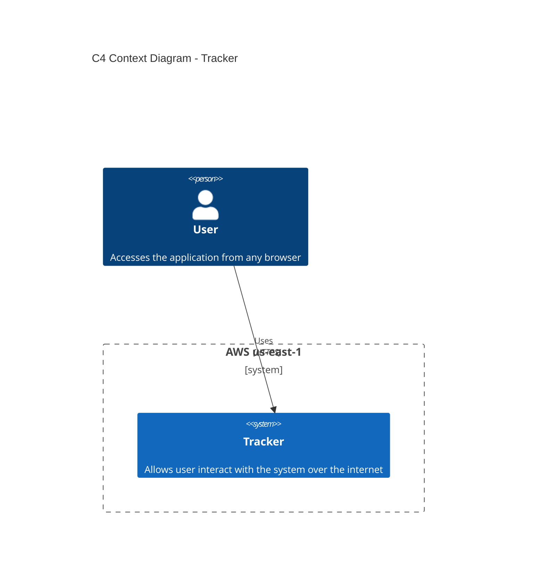
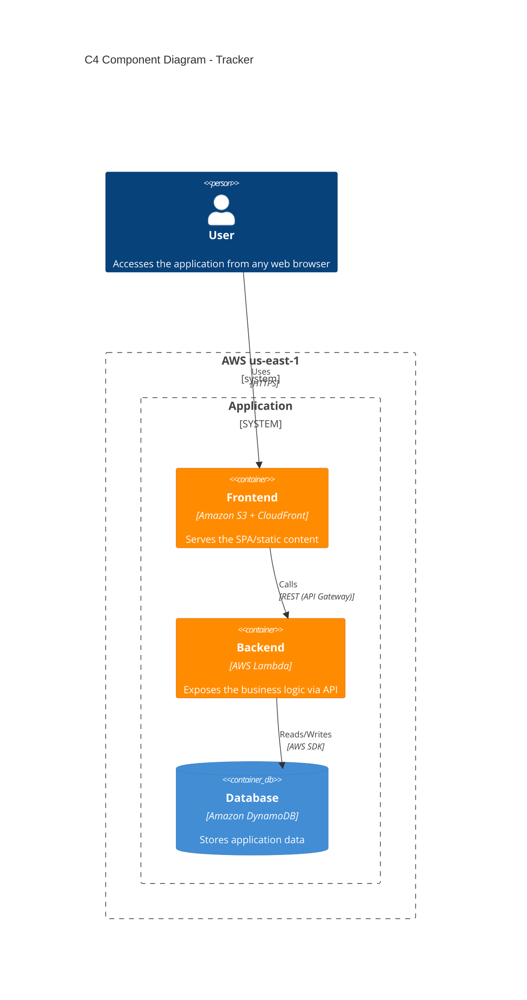

# 🎯 Tracker
A simple 1-click web-app for tracking meals and achieving nutrition goals, design, build and deploy on AWS serverless cloud-native architecture.

## 📋 Overview
**Tracker** is a light, small and simpliest serverless webapp SPA (single-page application) designed with software engineering process and cloud architecture practices using AWS serverless services.

## I.Requirements
### Functional requirement (FR)
-Track and add meals in 1-click

### non-functional requirement (NFR)Atributos de Calidad

 -Escalabilidad: Si el software podrá crecer cuando aumente el número de usuarios o datos.
 -Mantenibilidad: Diseñar componentes independientes y limpios para que corregir errores sea fácil.
 -Seguridad: Cómo se protegerán los datos y qué niveles de acceso habrá

### 🔐 Security Considerations
Security considerations are treated as part of the architecture rather than as a separate concern.
The project aims to follow principles such as:
* Least-privilege IAM permissions.
* No hard-coded credentials or secrets.
* HTTPS for client-to-API communication.
* Separation between application layers.
* Controlled access to persistent data.
* Environment-specific configuration.

## II.Design
### 🧩 Design Considerations
SOLID Principles
Five core design principles to write clean, maintainable, and scalable software:
* **S — Single Responsibility:** A class should do **only one thing**.
* **O — Open/Closed:** Code should be **open for extension, closed for modification**.
* **L — Liskov Substitution:** Subclasses must be **fully interchangeable** with their parent classes.
* **I — Interface Segregation:** Create **small, specific interfaces** rather than one bulky general-purpose one.
* **D — Dependency Inversion:** Depend on **abstractions (interfaces)**, never on concrete implementations.

* **Simplicity** — avoid unnecessary infrastructure and operational complexity.
* **Separation of concerns** — keep presentation, API, business logic, and persistence responsibilities separated.
* **Serverless-first architecture** — use managed AWS services where appropriate.
* **Scalability** — rely on managed services capable of scaling independently.
* **Maintainability** — keep the codebase and architecture easy to understand and evolve.
* **Security by design** — minimize unnecessary infrastructure exposure and access privileges.

The project focuses on keeping the architecture simple, scalable, and maintainable while following industry-recommended software architecture and SOLID principles.

## 🏗️ Architecture

The project is intentionally designed around the SOLID principles:

The system architecture is documented using the **C4 Model**, progressively describing the system from its high-level context to its internal components.

### C4 Context Diagram
The Context Diagram shows Tracker as a system and its relationship with the user.

### C4 Container Diagram
The Container diagram shows the main building blocks of the Tracker system and how they communicate.

### C4 Component Diagram
Shows internal structure of containers where additional decomposition provides architectural value:

## 🚀 Deployment
The application is designed to be deployed using AWS managed services.
The deployment architecture separates:
* Static frontend delivery with .
* API exposure with .
* Application execution with .
* Data persistence with .
Deployment automation and infrastructure-as-code will be added as the project evolves.

## 🧪 Testing
Testing will be introduced progressively as the application evolves.

## 🧰 Technology Stack
| Layer                      | Technology         |
| -------------------------- | ------------------ |
| Frontend                   | SPA                |
| CDN                        | Amazon CloudFront  |
| Static hosting             | Amazon S3          |
| API                        | Amazon API Gateway |
| Backend                    | AWS Lambda         |
| Database                   | Amazon DynamoDB    |
| Architecture documentation | C4 Model + Mermaid |

## 🗺️ Roadmap
* [x] Define mvp
* [x] Create mvp
* [x] Define architecture
* [ ] Document project components
* [ ] Document architecture decisions
* [ ] Add CI/CD pipeline
* [ ] Add infrastructure as code
* [ ] Add automated tests
* [ ] Implement access control capabilies with Cognito
* [ ] Improve observability and monitoring

## 📌 Project Status
This project is being developed incrementally to practic software engineering and cloud architecture practices.

## 📄 License
This project is licensed under the terms of the license included in this repository.

