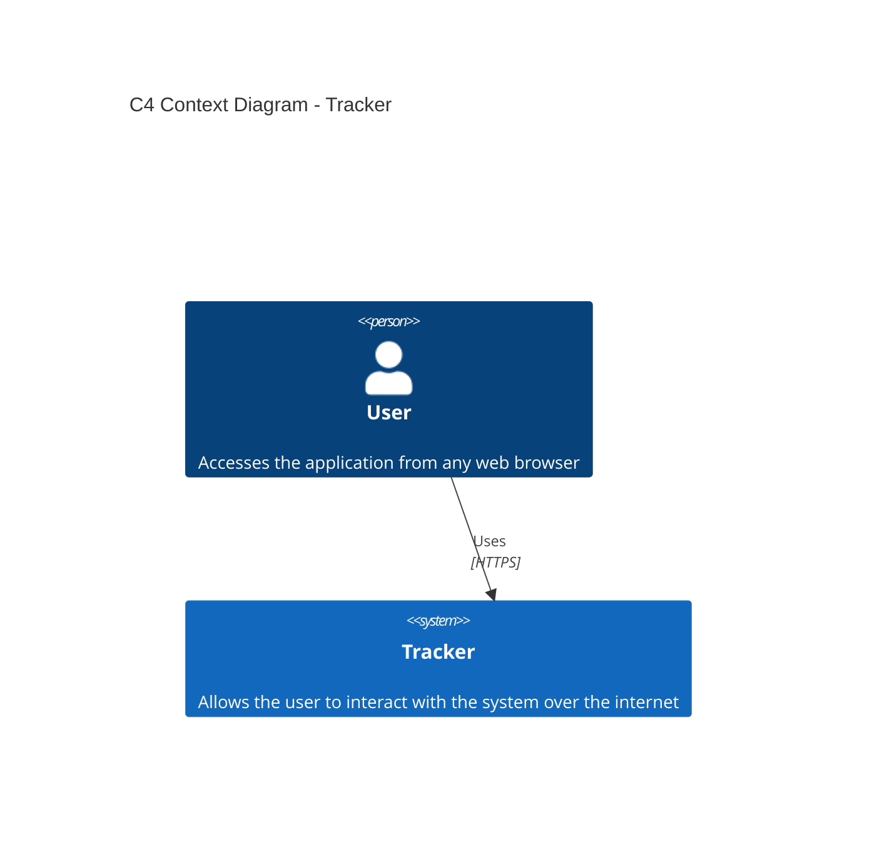
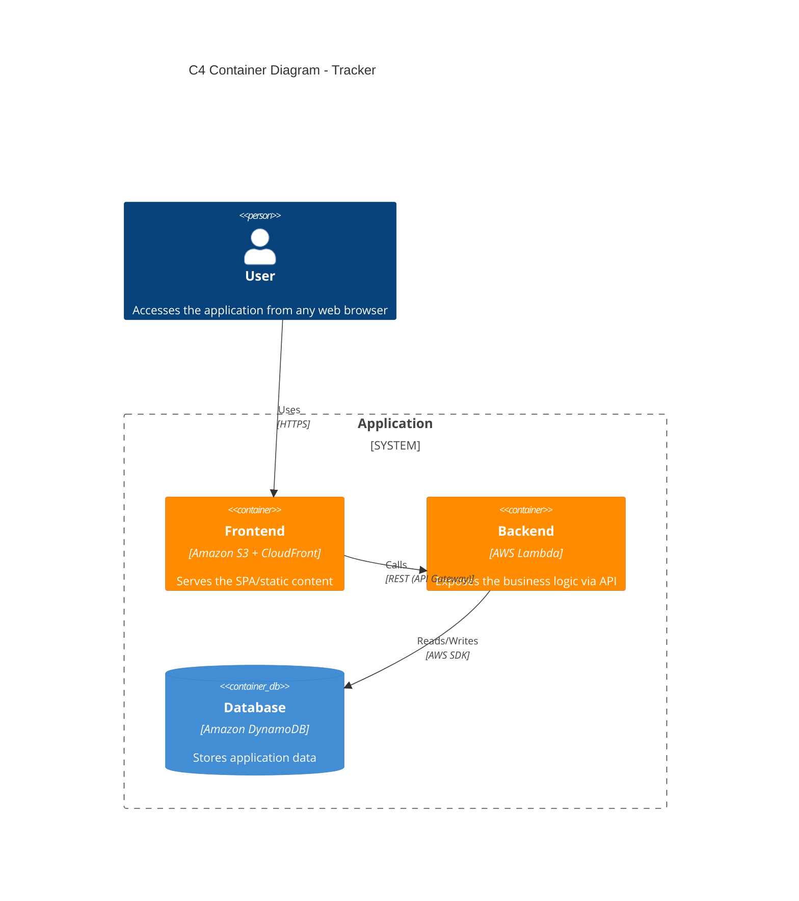

# tracker
Simple tracker, SPA microapp for easy track eats.

## 📐 Sistem Architecture (C4 Diagrams)

The follow diagrams show how the upper architectures on AWS for this microapp:

```mermaid
C4Context
    title C4 Context Diagram - Tracker

    Person(user, "User", "Accesses the application from any web browser")

    System(app, "Tracker", "Allows the user to interact with the system over the internet")

    Rel(user, app, "Uses", "HTTPS")

```

```mermaid
C4Container
    title C4 Container Diagram - Tracker

    Person(user, "User", "Accesses the application from any web browser")

    System_Boundary(system, "Application") {
        Container(frontend, "Frontend", "Amazon S3 + CloudFront", "Serves the SPA/static content")
        Container(backend, "Backend", "AWS Lambda", "Exposes the business logic via API")
        ContainerDb(db, "Database", "Amazon DynamoDB", "Stores application data")
    }

    Rel(user, frontend, "Uses", "HTTPS")
    Rel(frontend, backend, "Calls", "REST (API Gateway)")
    Rel(backend, db, "Reads/Writes", "AWS SDK")

    UpdateElementStyle(frontend, $bgColor="darkorange", $borderColor="chocolate", $fontColor="white")
    UpdateElementStyle(backend, $bgColor="darkorange", $borderColor="chocolate", $fontColor="white")

```
