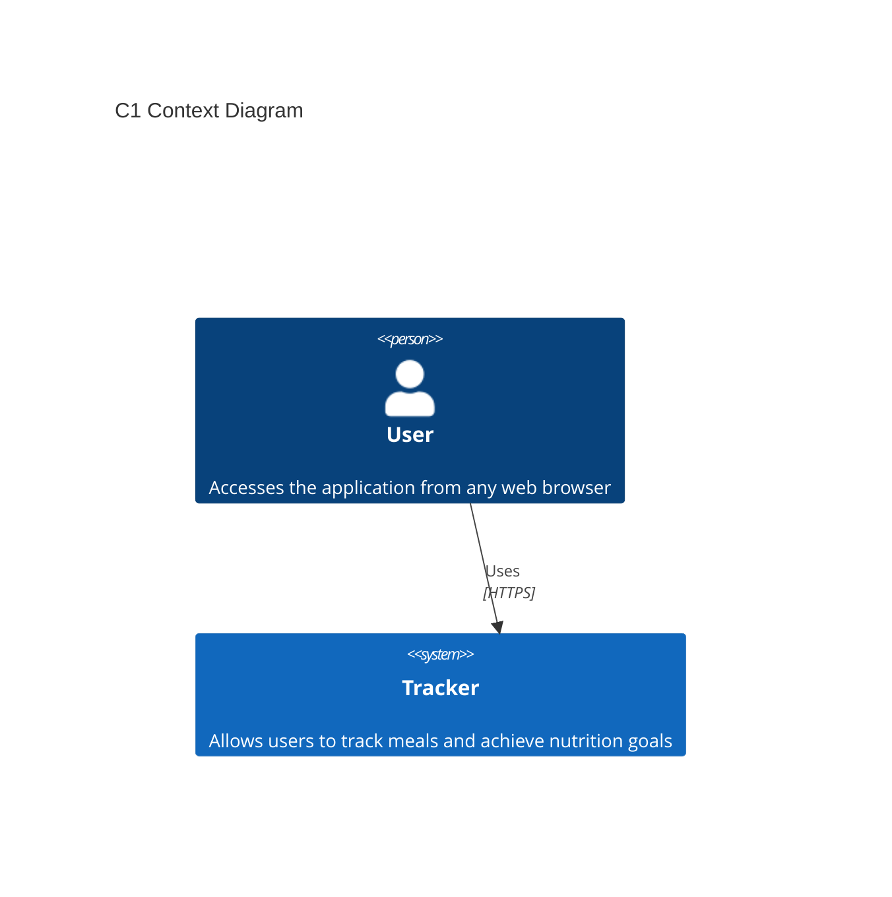
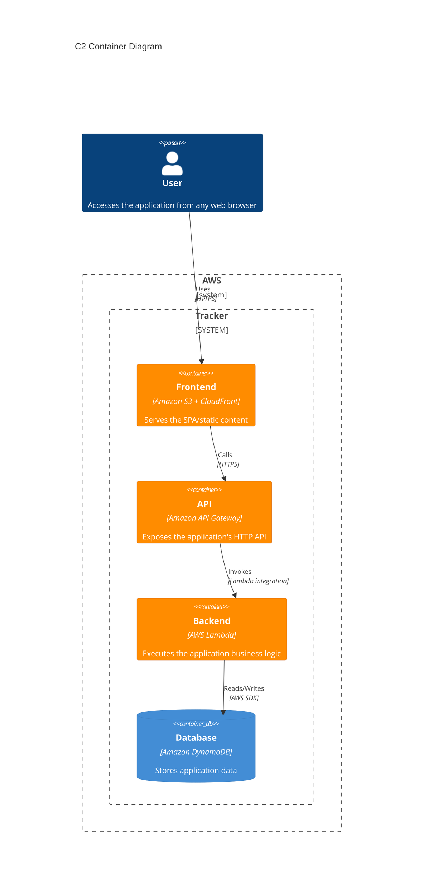
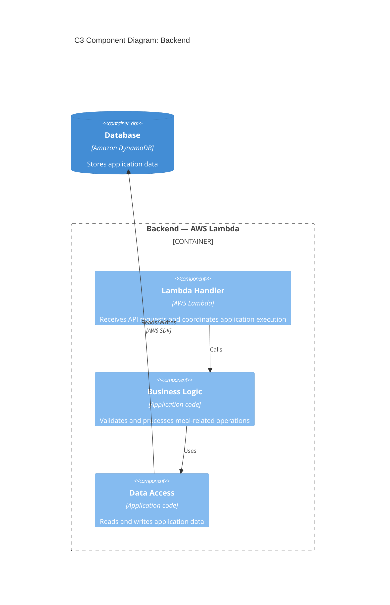

# 🎯 Tracker
A simple one-click web app for tracking meals and achieving nutrition goals, designed, built and deployed on a serverless, cloud-native AWS architecture.

## 📋 Overview
Tracker is a lightweight serverless SPA designed to practice software engineering processes and cloud architecture using AWS managed services.

## 📋 I. Requirements
### Functional Requirements
- **FR-01:** Track and add meals with a single click.
### Non-Functional Requirements
- **NFR-01 — Scalability:** The system should rely on managed services capable of scaling independently.
- **NFR-02 — Maintainability:** Codebase and architecture should remain easy to understand and evolve, while keeping components independent.
- **NFR-03 — Security by design:** Follow the principle of least privilege and minimize unnecessary infrastructure exposure.

## 🧩 II.Design
### Design Principles
* **Simplicity** : Avoid unnecessary infrastructure and operational complexity.
* **Separation of concerns** : keep presentation, API, business logic, and persistence responsibilities separated.
* **SOLID Principles** : Five core design principles to write clean, maintainable, and scalable software:
    * **S-Single Responsibility:** A module should do **only one thing**.
    * **O-Open/Closed:** Code should be **open for extension, closed for modification**.
    * **L-Liskov Substitution:** Subclasses must be **fully interchangeable** with their parent classes.
    * **I-Interface Segregation:** Create **small, specific interfaces** rather than one bulky general-purpose one.
    * **D-Dependency Inversion:** Depend on **abstractions (interfaces)**, never on concrete implementations.

## 🏗️ III. Architecture
The architecture focuses on simplicity, scalability, maintainability and clear separation of responsibilities.
The architecture favors AWS-managed services to reduce operational overhead.
The architecture is documented using the C4 Model, progressively describing the system from high-level to internal components:
### C1 Context Diagram
The Context Diagram shows Tracker as a system and its relationship with the user.


### C2 Container Diagram
The Container diagram shows the main building blocks of the Tracker system and how they communicate.


### C3 Component Diagram: Backend
Shows internal structure of containers where additional decomposition provides architectural value.


## 🧰 Tech Stack
| Layer                      | Technology         |
| -------------------------- | ------------------ |
| Frontend                   | SPA                |
| CDN                        | Amazon CloudFront  |
| Static hosting             | Amazon S3          |
| API                        | Amazon API Gateway |
| Backend                    | AWS Lambda         |
| Database                   | Amazon DynamoDB    |
| Architecture documentation | C4 Model + Mermaid |

## 🔐 Security
Security considerations are treated as part of the architecture rather than as a separate concern.
The project aims to follow principles such as:
* Controlled access to persistent data.
* HTTPS for client-to-API communication.
* No hard-coded credentials or secrets.
* Separation between application layers.

## 🚀 Deployment
Deployment automation by CI/CD and infrastructure-as-code it's been added.
### GitHub Actions:
***deploy.yml***
```
name: Deploy to S3 by ACCESS KEY

on:
  push:
    branches:
      - main

jobs:
  deploy:
    runs-on: ubuntu-latest

    steps:
    - name: Code checkout
      uses: actions/checkout@v4

    - name: Config AWS credentials
      uses: aws-actions/configure-aws-credentials@v4
      with:
        aws-access-key-id: ${{ secrets.AWS_ACCESS_KEY_ID }}
        aws-secret-access-key: ${{ secrets.AWS_SECRET_ACCESS_KEY }}
        aws-region: us-east-1 # Cambia esto por la región de tu bucket (ej. us-west-2)

    - name: Sync S3 files
      run: |
        aws s3 sync . s3://bucket-aws-pruebas --delete
```
### AWS ACCESS KEY
*IAM user>Security credentials>Create access key.

## 🧪 Testing
Automated testing in CI/CD will be introduced progressively as the application evolves.

## 🗺️ Roadmap
* [x] Define MVP
* [x] Define architecture
* [x] Create MVP
* [ ] Implement CI/CD pipeline
* [ ] Gradually define IaC (Infrastructure as Code)
* [ ] Add automated tests
* [ ] Implement CI/CD pipeline by OIDC
* [ ] Implement access control, social login, OAuth 2.0/OIDC with Amazon Cognito
* [ ] Improve observability and monitoring

## 📌 Status
This project is being developed incrementally to practice software engineering and cloud architecture principles.

## 📄 License
This project is licensed under the **PolyForm Noncommercial License 1.0.0**. You are free to use, modify, and share this software strictly for **non-commercial purposes** (such as personal use, education, or research). Any commercial exploitation, direct or indirect, is strictly prohibited without a prior written commercial agreement from the author.
THE SOFTWARE IS PROVIDED "AS IS", WITHOUT WARRANTY OF ANY KIND, EXPRESS OR IMPLIED. For the full legal terms, please refer to the [LICENSE](LICENSE) file.


