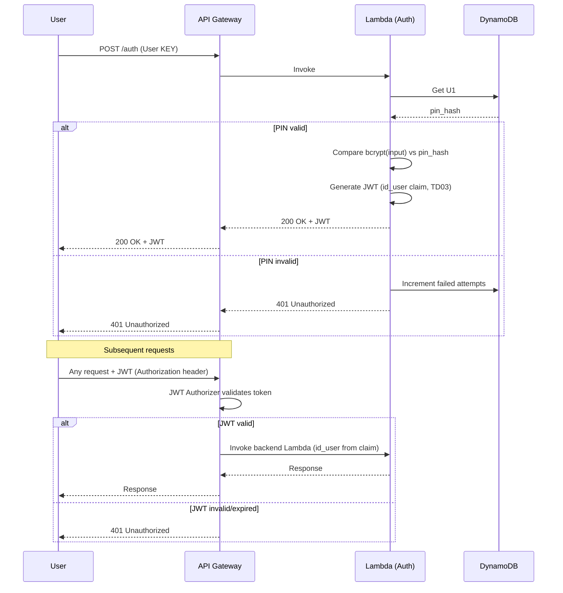
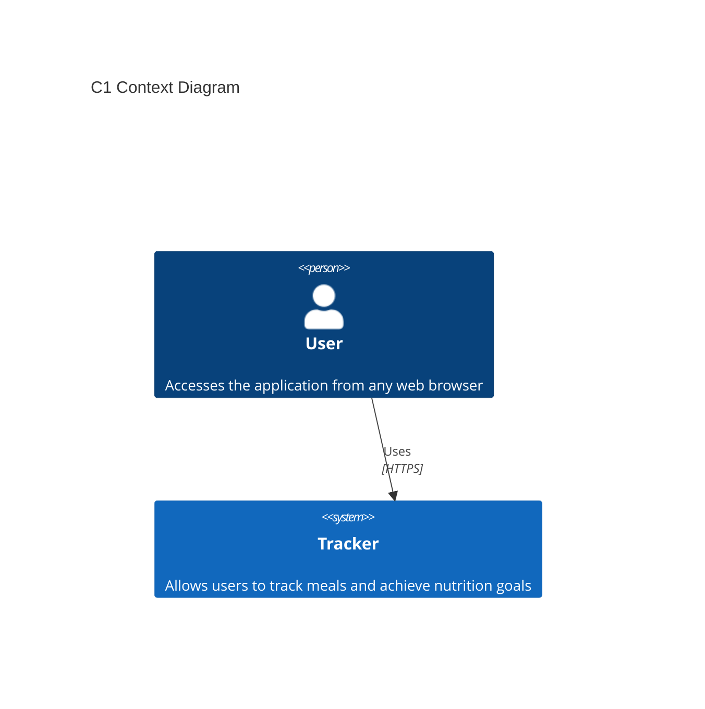
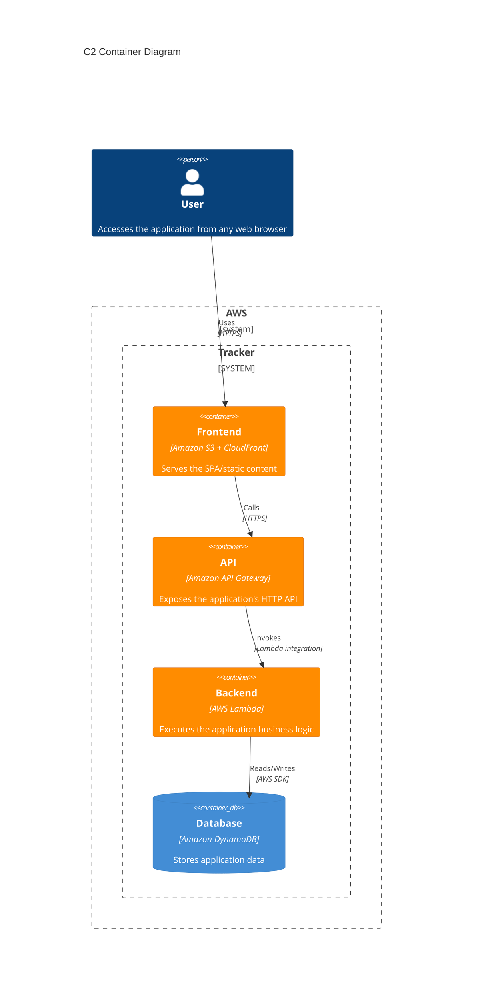
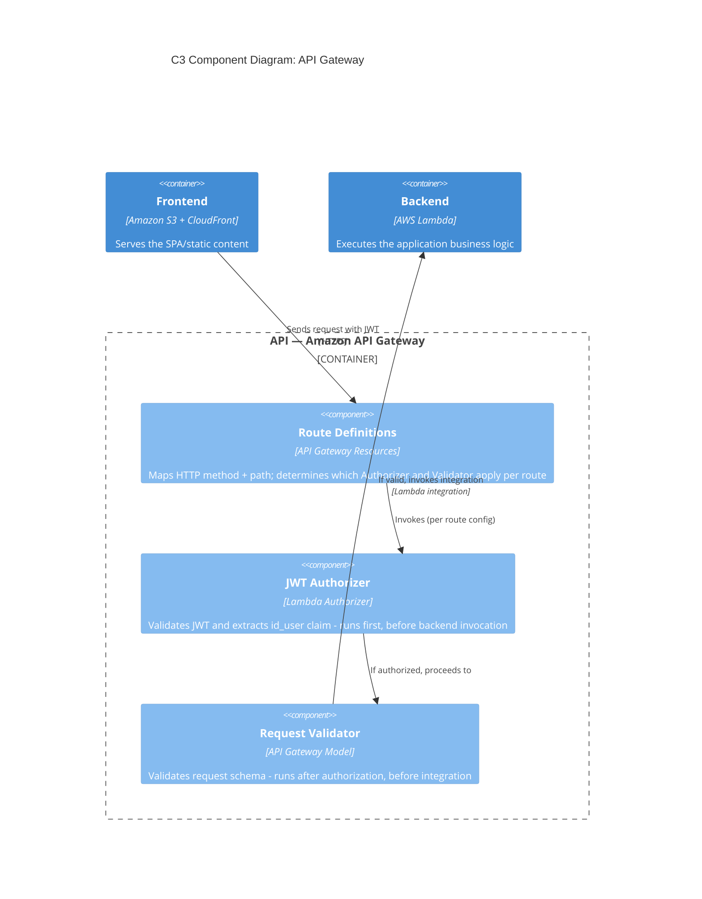
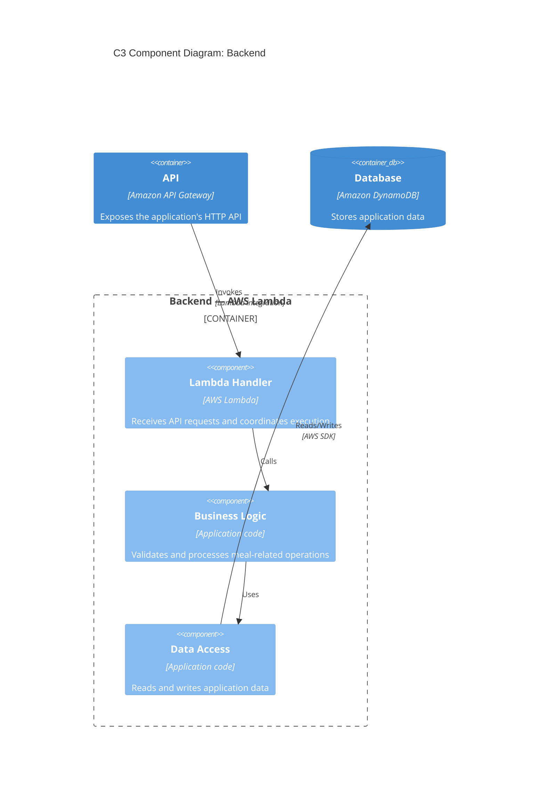
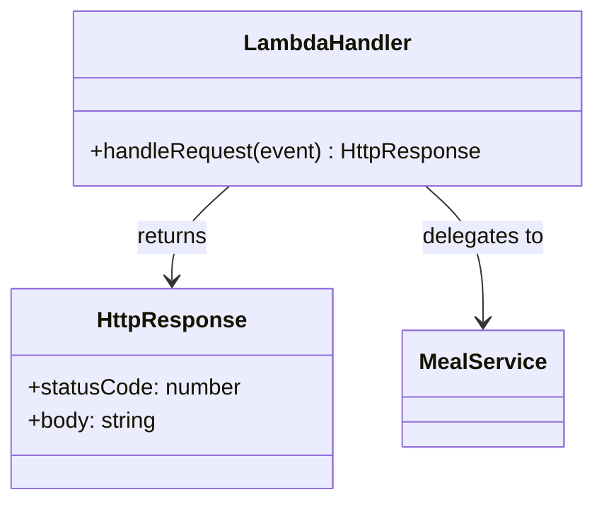
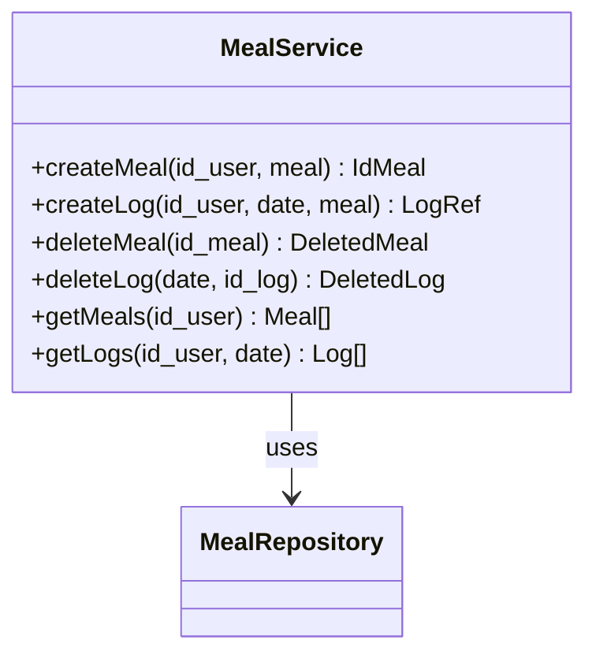
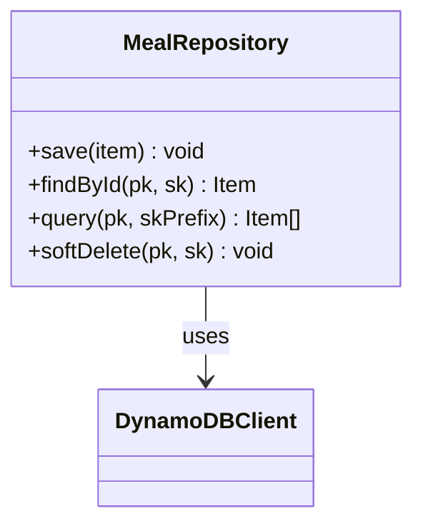

# 🎯 Tracker
A simple one click web app for tracking meals to achieve nutrition goals.

## 📋 Executive Summary
Tracker is a lightweight serverless SPA designed according to software development lifecycle (SDLC) practices, applying fundamental software engineering principles and design patterns. On well architected AWS cloud managed services.

## 📌 Status
This project is being developed incrementally to practice software engineering and cloud architecture principles.

## 📋 I. Requirements
### ⚙️ Functional Requirements
- **FR01:** Log meals with a single click in "+" button.
- **FR02:** Display a week navigator.
- **FR03:** Display kcal and macros for the selected date.
- **FR04:** Display **available meals** and **logged meals**.
- **FR05:** Add button for: Soft delete Available meals.
- **FR06:** Add button for: Soft delete Logged meals.
### 🏛️ Non-Functional Requirements (architectural characteristics)
| NFR | Measurable Goal |
|---|---|
| NFR01 Security | 0 credentials in code; JWT lifespan ≤ 1h; automatic secret rotation every 30 days using AWS Secrets Manager; 100% clases Principle of least privilege |
| NFR02 Maintainability | Test coverage > 80% in business logic layer; cyclomatic complexity < 10 per function |
| NFR03 Availability | 99.5% monthly (allowing for Lambda cold starts) |
| NFR04 Scalability | Support 100 concurrent users with < 500ms p95 latency without infrastructure changes |
| NFR05 Cost | Do not exceed maximum budget of $100/y |

### Technical decisions
- **TD01:** User access by user and password credentials.
- **TD02:** Store password always hashed (bcrypt).
- **TD03:** Implement 1h-exp JWT signed with HS256, secret stored in AWS Secrets Manager.
- **TD04:** Store JWT in safe place, never in localStorage.
- **TD05:** 6-alphanumeric char case-insensitive ID is secure by calculating with +2 billions of combinations means ~0.000056% daily collisions risk with 50 meals items and ~0.0229% catalog meals collision risk with 1000 items.


## 🛠️ II. SecDevOps: Principles & Patterns
### 🔐 Security
Security considerations are treated as part of the design and architecture rather than as a separate concern. The project aims to follow principles such as:
* HTTPS for client-to-API communication.
* Separation between application layers.
* Controlled access to persistent data.
* No hard-coded credentials.
### 🎯 Threat Model (minimal)
| Threat | Mitigation |
| --- | --- |
| PIN brute-force | Temporary block after N failed attempts (TD06) |
| JWT theft/replay | 1h exp (TD03), HTTPS-only transport |
| Cross-user data access | id_user derived only from JWT claim, never client input |
| Stolen/leaked JWT secret | Stored in Secrets Manager, not in code/env vars committed to repo |
| User ID broke access | uuid+6-char alphanumeric secret User PIN(TD04) makes guessing impractical |
| Database breach exposing PINs | Stored hashed (bcrypt), never plaintext (TD08) |
### 🔐 Authentication Flow
1. User access with User KEY, repeated invalid attempts trigger temporary block (TD06).
2. Backend validates User KEY, creates session, issues JWT (TD03).
3. Client sends JWT on every subsequent API call (Authorization header).
4. Lambda extracts id_user embedded as claim from JWT (TD03) (this is the trusted source of truth).

```js
const jwt = require('jsonwebtoken');// explicit verify never dynamic

function verifyToken(token) {
  return jwt.verify(token, SECRET, { // implement AWS Secrets
    algorithms: ['HS256'],   // fix, never get from token
    issuer: 'tracker-api',
    audience: 'tracker-frontend',
  });
}
```
```json
{ //claims estándar. Agrega iss, aud, jti
  "sub": "U1",
  "iss": "tracker-api",
  "aud": "tracker-frontend",
  "iat": 1732000000,
  "exp": 1732086400,
  "jti": "a1b2c3d4"
}
```
### 🔄 Sequence Diagram: Authentication Flow

### 🔐 Principles
* **YAGNI:** (You Aren't Gonna Need It), **DRY:** (Don't Repeat Yourself), **KISS:** Keep It Simple, Sir.
* **SOLID Principles:** Core design principles to write clean code and maintainable software:
  * **[S]ingle Responsibility:** A module should do **only one thing**.
  * **[O]pen/Closed:** Code should be **open for extension, closed for modification**.
  * **[L]iskov Substitution:** Subclasses must be **fully interchangeable** with their parent classes.
  * **[I]nterface Segregation:** Create **small, specific interfaces** over one general-purpose one.
  * **[D]ependency Inversion:** Depend on **abstractions (interfaces)**, never on concrete implementations.
### 🔐 Patterns
* **Creational patterns:** Provide various creation mechanism increase quality of code.
* **Structural patterns:** Explain how to assemble objects and classes.
* **Behavioral patterns:** Concerned with algorithms and the responsability assignment.

## 📐 III. Software & DB Design

### 🖥️ Frontend Design
    Observer Design Pattern: to show changes in HEADER if logged list is modify.
#### HEADER
1. **`[ S/1 | M/2 | T/3 | W/4 | T/5 | S/6 | S/7 ]`** (**FR02:** week-nav: day of week + day of month).
2. **`[ Kcal | Prot | Carb | Fat ]`** (**FR03:** Kcal & macros for the selected date).
#### BODY
1. **`[ < Logged list > ]`** (**FR04:** Logged meals eaten).
2. **`[ < Meals list > ]`** (**FR01, FR04:** Available meals catalog, with add (+) button).
### 🖥️ Frontend Design Wireframe
```
┌───────────────────────────────┐
│   S | M | T | W | T | S | S   │   (FR02)
│   1 | 2 | 3 | 4 | 5 | 6 | 7   │   (FR02)
│    Kcal | Prot | Carb | Fat   │   (FR03)
├───────────────────────────────┤
│                               │
│ [ Logged List (K|P|C|G) (x) ] │   (FR04)
│                               │
│ [ Meals List      (-) N (+) ] │   (FR01,FR04)
│                               │
└───────────────────────────────┘
```
### 🗃️ API Gateway
Auth strategy: JWT (see Authentication Flow) for user identity: id_user always derived from JWT claim, never accepted as client input.

API Version: /v1

Contract: 
| Method | Endpoint | Description | Related FR |
| --- | --- | --- | --- |
| POST | `/meal` | Register {meal} in catalog | TD02 |
| POST | `/log` | Log meal in selected date {date, {meal}} | FR01 |
| PATCH | `/meal/{id_meal}` | Soft delete meal of catalog | TD03 |
| PATCH | `/log/{id_log}` | Soft delete logged meal | TD01 |
| GET | `/meals` | Returns Available meals catalog | FR04 |
| GET | `/logs?date=` | Returns Logged meals for a given date | FR03, FR04 |

Request/Response examples:
```json
// 1. HTTP POST /meal
{ "meal": { "id_meal": "", "label": "100g almonds", "k": "579", "p": "21", "c": "22", "f": "50" } }

// `a1a1a1` Backend generates
// DynamoDB state after write:
// Meal: | U1#MEAL | 20260719#a1a1a1#01 | null | {meal}

// HTTP/1.1 201 Created
{ "id_meal": "a1a1a1" }
```

```json
// 2. HTTP POST /log
{ "date": "20260719", { "id_meal": "a1a1a1", "label": "100g almonds", "k": "579", "p": "21", "c": "22", "f": "50" } }

// `b1b1b1` Backend generates
// DynamoDB state after write:
// Logged: | U1#LOGGED | 20260719#b1b1b1#01 | null | {meal}

// HTTP/1.1 201 Created
{ "id_log": "b1b1b1", "order": "01" }
```

```json
// 3. HTTP PATCH /meals/{id_meal}

// DynamoDB state after write:
// Deleted Meal: | U1#MEAL | 20260719#a2a2a2 | 20260719#131313 | {meal}

// HTTP/1.1 200 OK
{ "id_meal": "a2a2a2", "DeletedAt": "20260719#131313" }
```

```json
// 4. HTTP PATCH /logs/{id_log}?date=20260719

// DynamoDB state after write:
// Deleted Logged: | U1#LOGGED | 20260719#b1b1b1#01 | 20260719#141414 | {meal}

// HTTP/1.1 200 OK
{ "date": "20260719", "id_log": "b1b1b1", "order": "01", "DeletedAt": "20260719#141414" }
```

```json
// 5. HTTP GET /meals

// DynamoDB state before read:
// Meal: | U1#MEAL | 20260719#a1a1a1#01 | null | {meal}
// Meal: | U1#MEAL | 20260719#a2a2a2#02 | 20260719#131313 | {meal}
// Meal: | U1#MEAL | 20260719#a3a3a3#03 | null | {meal}

// Response 200
[
  { "id_meal": "a1a1a1", "label": "100g almonds", "k": "579", "p": "21", "c": "22", "f": "50" },
  { "id_meal": "a2a2a2", "label": "100 grams of almonds", "k": "579", "p": "21", "c": "22", "f": "50" },
  { "id_meal": "a3a3a3", "label": "155g yogurt", "k": "285", "p": "12", "c": "133", "f": "8" }
]
```

```json
// 6. HTTP GET /logs?date=20260719

// DynamoDB state before read:
// Logged: | U1#LOGGED | 20260719#b1b1b1#01 | 20260719#141414 | {meal}
// Logged: | U1#LOGGED | 20260719#b2b2b2#02 | null | {meal}
// Logged: | U1#LOGGED | 20260719#b3b3b3#03 | null | {meal}

// Response 200
[
  { "id_log": "b1b1b1", "order": "01", "meal": { "id_meal": "a1a1a1", "label": "100g almonds", "k": "579", "p": "21", "c": "22", "f": "50" } },
  { "id_log": "b2b2b2", "order": "02", "meal": { "id_meal": "a1a1a1", "label": "100g almonds", "k": "579", "p": "21", "c": "22", "f": "50" } },
  { "id_log": "b3b3b3", "order": "03", "meal": { "id_meal": "a3a3a3", "label": "155g yogurt", "k": "285", "p": "12", "c": "133", "f": "8" } }
]
```

Error handling:
| Status | Case | Example endpoint |
| --- | --- | --- |
| 404 | Resource not found (id_log/id_meal doesn't exist) | `PATCH /log/{id_log}` |
| 409 | Conflict — meal already logged for that date/id | `POST /log` |

### 🗄️ Backend Design
    S-SOLID Design Principles: Single responsibility for components and methods.
    Singleton Design Pattern: Ensure single DB connections.
    
#### AWS Lambda Function Signatures
```
MealService.createMeal(id_user,{meal}) : IdMeal
MealService.createLog(id_user,date,{meal}) : LogRef
MealService.deleteMeal(id_meal) : DeletedMeal
MealService.deleteLog(date,id_log) : DeletedLog
MealService.getMeals(id_user) : Meal[]
MealService.getLogs(id_user,date) : Log[]
```

Return Types:
| Type | Shape |
| --- | --- |
| `IdMeal` | `{ "id_meal": string }` |
| `LogRef` | `{ "id_log": string, "order": string }` |
| `DeletedMeal` | `{ "id_meal": string, "DeletedAt": string }` |
| `DeletedLog` | `{ "date": string, "id_log": string, "order": string, "DeletedAt": string }` |

### 🗃️ Data Modeling (Amazon DynamoDB)
Amazon DynamoDB Single-Table Design:
```
aws dynamodb create-table \                   # create table
    --table-name Tracker \
    --attribute-definitions \
        AttributeName=PK,AttributeType=S \
        AttributeName=SK,AttributeType=S \
    --key-schema \
       AttributeName=PK,KeyType=HASH \
       AttributeName=SK,KeyType=RANGE \
    --billing-mode PAY_PER_REQUEST
```
Example Table Data:
| Mapping | PK | SK | DeletedAt | Data
| --- | --- | --- | --- | --- |
| User: | U1#METADATA | 20260719 | null | {metadadata}
| User: | U1#PIN_HASH | 20260719 | null | {pin_hash}
| Meal: | U1#MEAL | 20260719#a1a1a1 | null | {meal}
| Meal: | U1#MEAL | 20260719#a2a2a2 | 20260719#131313 | {meal}
| Meal: | U1#MEAL | 20260719#a3a3a3 | null | {meal}
| Logged: | U1#LOGGED | 20260719#b1b1b1#01 | 20260719#141414 | {meal}
| Logged: | U1#LOGGED | 20260719#b2b2b2#02 | null | {meal}
| Logged: | U1#LOGGED | 20260719#b3b3b3#03 | null | {meal}


## 🏗️ IV. Architectural Design (C4 Model)
The architecture focuses on simplicity, scalability, maintainability and clear separation of responsibilities prioritizes AWS managed services to reduce operational overhead.

The architecture is documented using the C4 Model, progressively describing the system from high-level to internal components:
### 🌐 C1 Context Diagram
The Context Diagram shows Tracker as a system and its relationship with the user.


### 📦 C2 Container Diagram
The Container diagram shows the main building blocks of the Tracker system and how they communicate.

### 🧩 C3 Component Diagram: API Gateway
Shows internal structure of the API Gateway container.


### 🧩 C3 Component Diagram: Backend
Shows internal structure of the Backend (Lambda) container.

### 💻 C4 Code Diagram: Lambda Handler

### 💻 C4 Code Diagram: Business Logic

### 💻 C4 Code Diagram: Data Access


## 🧰 V. Tech Stack
| Layer | Technology | Status |
| --- | --- | --- |
| Architecture documentation | C4 Model + Mermaid | Implemented |
| Frontend | JavaScript SPA | Implemented |
| Static hosting | Amazon S3 | Implemented |
| CI/CD | GitHub Actions | Implemented |
| CDN | Amazon CloudFront | Planned |
| Database | Amazon DynamoDB | Planned |
| Backend | AWS Lambda | Planned |
| API | Amazon API Gateway | Planned |
| Authentication | JWT (HS256) + API Gateway Lambda Authorizer | Planned |
| Secrets Management | AWS Secrets Manager | Planned |

## 🚀 VI. Deployment & DevOps
The frontend static site deployment is automated with **CI/CD** using **GitHub Actions** workflow that every push to `main` triggers syncs github repo to **Amazon S3 bucket**.

### 🔑 Access Config
* AWS: S3>Create bucket.
* AWS: IAM user>Security credentials>Create access key.
* Repo: settings>Actions secrets and variables>Actions>New repository secrets: Add 2 secrets: access key & secret key.

### 🔁 CI/CD Pipeline (GitHub Actions)
***deploy.yml***
```
name: GitHub Actions Deploy to S3 by ACCESS KEY

on:
  push:
    branches:
      - main

jobs:
  deploy:
    runs-on: ubuntu-latest

    steps:
    - name: Code checkout
      uses: actions/checkout@v4

    - name: Config AWS credentials
      uses: aws-actions/configure-aws-credentials@v4
      with:
        aws-access-key-id: ${{ secrets.AWS_ACCESS_KEY_ID }}
        aws-secret-access-key: ${{ secrets.AWS_SECRET_ACCESS_KEY }}
        aws-region: us-east-1 # AWS bucket region

    - name: Sync S3 files
      run: | # --delete flag removes files from the S3 bucket that no longer exist in repo
        aws s3 sync . s3://bucket-aws-pruebas --delete
```

### 🧪 Automated Testing
_`< Automated testing in CI/CD will be introduced progressively as the application evolves >`_

## 🗺️ VII. Roadmap
* [x] Define MVP
* [x] Implement Frontend
* [x] Create monolithic architecture prototype
* [x] Implement CI/CD pipeline (Git+Action+Credentials)
* [x] Define the DynamoDB table
* [ ] Implement Amazon DynamoDB
* [ ] Implement Backend AWS Lambda
* [ ] Implement Amazon API Gateway
* [ ] Implement JWT
* [ ] Add OpenAPI specification (openapi.yaml)
* [ ] Implement Login Email with "IT WASN'T ME" button to kill JWT & generates new User PIN
* [ ] Implement PIN-code access page
* [ ] Launch MVP (Send VIP PIN-code)
* [ ] Gradually define IaC (Infrastructure as Code)
* [ ] Add automated tests
* [ ] Implement CI/CD pipeline by OIDC
* [ ] Implement access control, social login, OAuth 2.0/OIDC with Amazon Cognito
* [ ] Improve observability and monitoring

## 📄 VIII. License
This project is licensed under the **PolyForm Noncommercial License 1.0.0**. You are free to use, modify, and share this software strictly for **non-commercial purposes** (such as personal use, education, or research). Any commercial exploitation, direct or indirect, is strictly prohibited without a prior written commercial agreement from the author.
THE SOFTWARE IS PROVIDED "AS IS", WITHOUT WARRANTY OF ANY KIND, EXPRESS OR IMPLIED. For the full legal terms, please refer to the [LICENSE](LICENSE) file.


