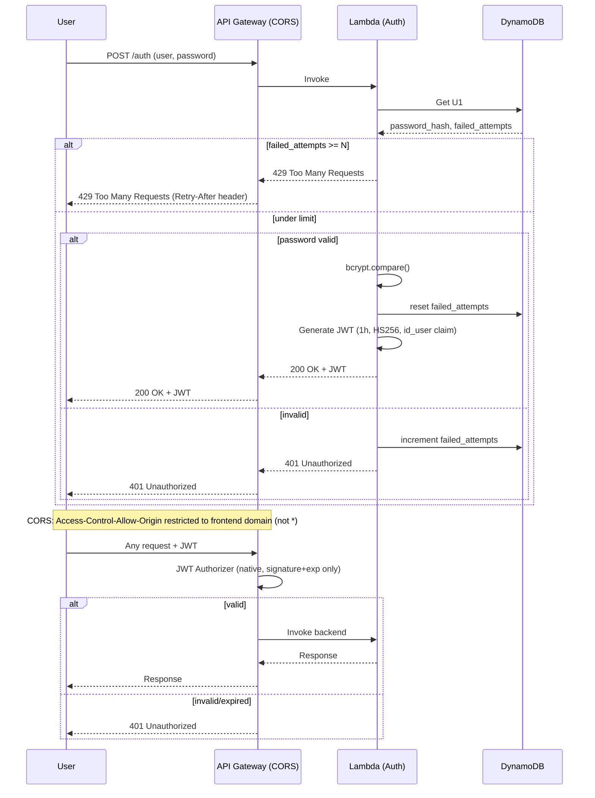
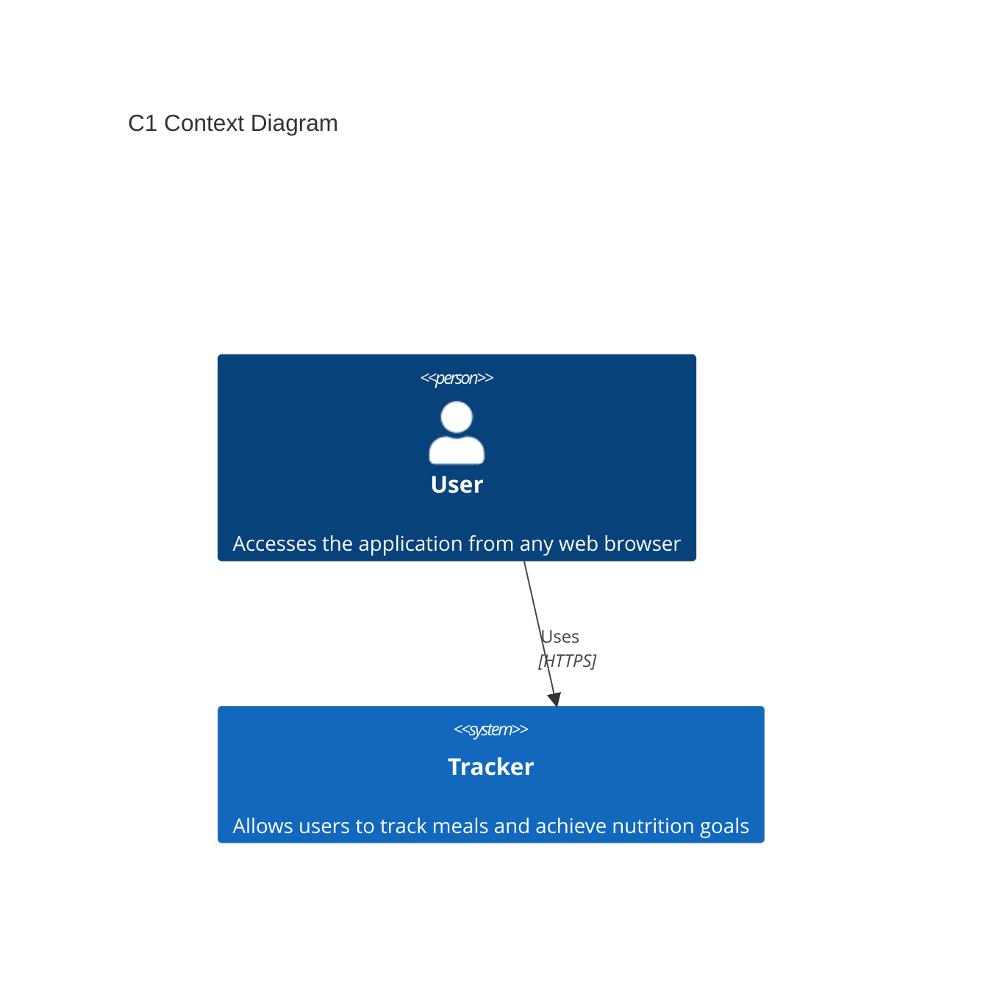
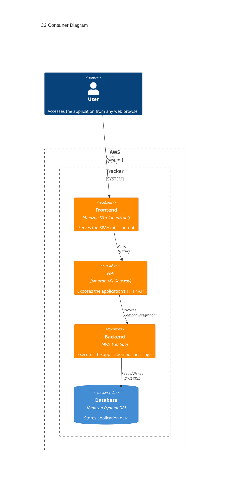
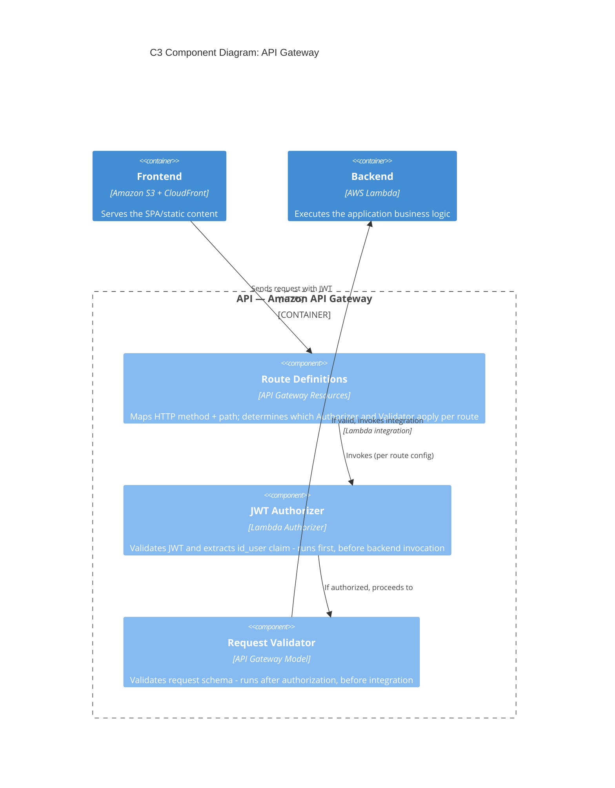
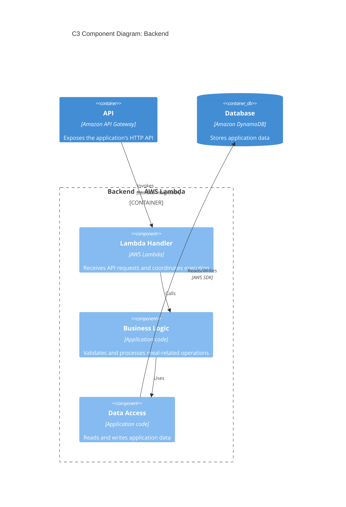
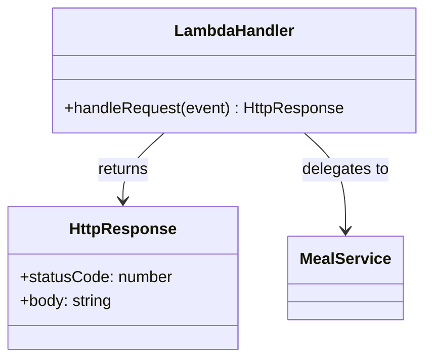
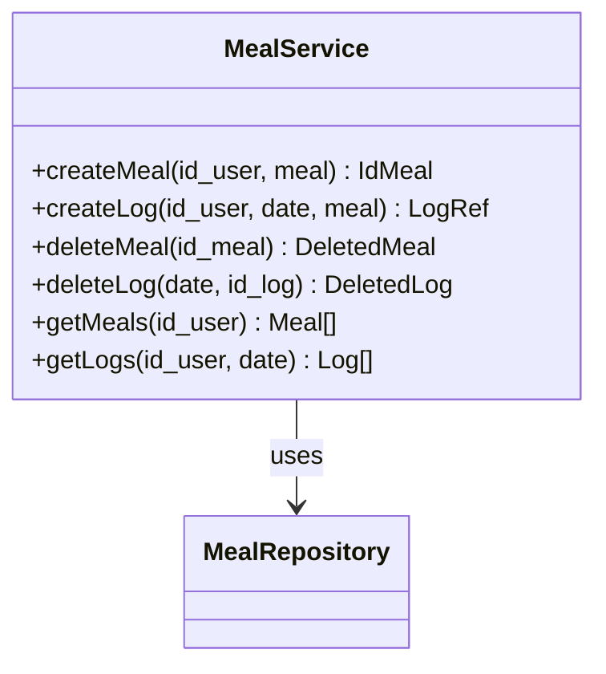
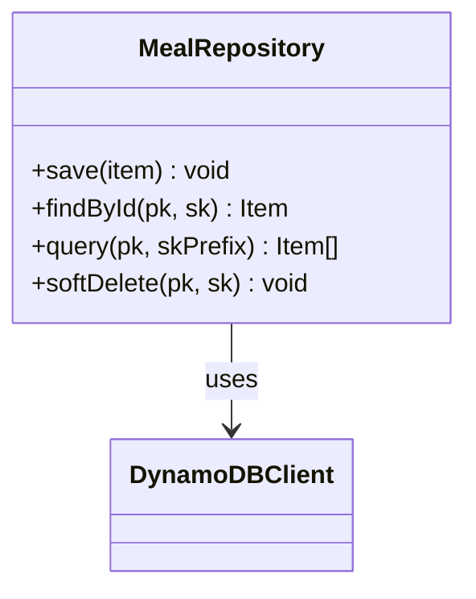

# 🎯 Tracker
A simple app for tracking meals to achieve yours goals in 1-click.

## 📋 Executive Summary
Tracker is built on a simple premise: less is more. Keep deliberately minimal design and remove friction make user's data private by defaul and logging a meal in 1-click.

## 📌 Status
Actively built as an incremental project, applying SDLC practices, cloud architecture principles and AWS Well-Architected patterns.

## 📋 I. Requirements
### ⚙️ Functional Requirements
- **FR-01:** Log meals with a single click in "+" button.
- **FR-02:** Display a week navigator.
- **FR-03:** Display kcal and macros for the selected date.
- **FR-04:** Display **available meals** and **logged meals**.
- **FR-05:** Add button for: Soft delete Available meals.
- **FR-06:** Add button for: Soft delete Logged meals.
### 🏛️ Non-Functional Requirements (architectural characteristics)
| NFR | Measurable Goal |
|---|---|
| NFR-01 Security | 0 credentials in code; JWT lifespan ≤ 1h; automatic secret rotation every 30 days using AWS Secrets Manager; 100% clases Principle of least privilege |
| NFR-02 Maintainability | Test coverage > 80% in business logic layer; cyclomatic complexity < 10 per function |
| NFR-03 Availability | 99.5% monthly (allowing for Lambda cold starts) |
| NFR-04 Scalability | Support 100 concurrent users with < 500ms p95 latency without infrastructure changes |
| NFR-05 Cost | Do not exceed maximum budget of $100/y |

### Architecture Decision Record
### ADR-01: Authentication method & Password storage
Decision: user access with credentials and password is stored in bcrypt hash.
Why: hashing with salts to resists brute force via cost factor
Trade-off: needs a password-reset flow (not yet in scope).

### ADR-02: JWT lifetime & signing
Decision: 1h JWT, HS256, secret in Secrets Manager.
Why: native API Gateway JWT Authorizer so short window limits damage from token theft and symmetric signing is enough for a single-service API. 
Trade-off: no revocation before expiry mitigated by the short TTL.

### ADR-03: JWT client storage
Decision: JWT store local in secure cookie never localStorage.
Why: avoids XSS-based token theft risk.
Trade-off: Symmetric HS256 is enough intead asymmetric RS256/ES256 

### ADR-04: Resource ID format
Decision: 6-char case-insensitive alphanumeric ID.
Why: readable and +2 billions combinations means <0.03% collision risk at 1000 items.
Trade-off: not ID unpredictability.

## 🛠️ II. SecDevOps: Principles & Patterns
### 🔐 Security
Security considerations are treated as part of the design and architecture rather than as a separate concern. The project aims to follow principles such as:
* HTTPS for client-to-API communication.
* Separation between application layers.
* Controlled access to persistent data.
* No hard-coded credentials.
### 🎯 Threat Model
| Threat | Mitigation |
| --- | --- |
| Database breach exposing password | Pass stored hashed (bcrypt) never in plaintext (ADR-01) |
| Password brute-force | Temporary block after N failed attempts) |
| JWT theft/replay | 1h exp (TD-03), HTTPS-only transport |
| Cross-user data access | id_user derived only from JWT claim, never client input |
| Stolen/leaked JWT secret | Stored in Secrets Manager, not in code/env vars committed to repo |

### 🔐 Authentication Flow
1. User access with credentials, repeated invalid attempts trigger temporary block (ADR-01).
2. Backend validates credentials, creates session and issues JWT (ADR-02).
3. Client sends JWT hosted on every subsequent API call (ADR-03) .
4. Lambda extracts id_user embedded as claim from JWT (this is the trusted source of truth).

```js
const jwt = require('jsonwebtoken');// explicit verify never dynamic

function verifyToken(token) {
  return jwt.verify(token, SECRET, { // implement AWS Secrets
    algorithms: ['HS256'],   // fix, never get from token
    issuer: 'tracker-api',
    audience: 'tracker-frontend',
  });
}
```
```json
{ //claims estándar. Agrega iss, aud, jti
  "sub": "U1",
  "iss": "tracker-api",
  "aud": "tracker-frontend",
  "iat": 1732000000,
  "exp": 1732086400,
  "jti": "a1b2c3d4"
}
```
### 🔄 Sequence Diagram: Authentication Flow

```mermaid
sequenceDiagram
    participant U as User
    participant API as API Gateway (CORS)
    participant L as Lambda (Auth)
    participant DB as DynamoDB

    U->>API: POST /auth (user, password)
    API->>L: Invoke
    L->>DB: Get U1#CREDENTIALS + failed_attempts
    DB-->>L: password_hash, failed_attempts
    alt failed_attempts >= N
        L-->>API: 429 Too Many Requests
        API-->>U: 429 Too Many Requests (Retry-After header)
    else under limit
        alt password valid
            L->>L: bcrypt.compare()
            L->>DB: reset failed_attempts
            L->>L: Generate JWT (1h, HS256, id_user claim)
            L-->>API: 200 OK + JWT
            API-->>U: 200 OK + JWT
        else invalid
            L->>DB: increment failed_attempts
            L-->>API: 401 Unauthorized
            API-->>U: 401 Unauthorized
        end
    end
    Note over U,API: CORS: Access-Control-Allow-Origin restricted to frontend domain (not *)
    U->>API: Any request + JWT
    API->>API: JWT Authorizer (native, signature+exp only)
    alt valid
        API->>L: Invoke backend
        L-->>API: Response
        API-->>U: Response
    else invalid/expired
        API-->>U: 401 Unauthorized
    end
```
### 🔐 Principles
* **YAGNI:** (You Aren't Gonna Need It), **DRY:** (Don't Repeat Yourself), **KISS:** Keep It Simple, Sir.
* **SOLID Principles:** Core design principles to write clean code and maintainable software:
  * **[S]ingle Responsibility:** A module should do **only one thing**.
  * **[O]pen/Closed:** Code should be **open for extension, closed for modification**.
  * **[L]iskov Substitution:** Subclasses must be **fully interchangeable** with their parent classes.
  * **[I]nterface Segregation:** Create **small, specific interfaces** over one general-purpose one.
  * **[D]ependency Inversion:** Depend on **abstractions (interfaces)**, never on concrete implementations.
### 🔐 Patterns
* **Creational patterns:** Provide various creation mechanism increase quality of code.
* **Structural patterns:** Explain how to assemble objects and classes.
* **Behavioral patterns:** Concerned with algorithms and the responsability assignment.

## 📐 III. Software & DB Design

### 🖥️ Frontend Design
    Observer Design Pattern: to show changes in HEADER if logged list is modify.
#### HEADER
1. **`[ S/1 | M/2 | T/3 | W/4 | T/5 | S/6 | S/7 ]`** (**FR02:** week-nav: day of week + day of month).
2. **`[ Kcal | Prot | Carb | Fat ]`** (**FR03:** Kcal & macros for the selected date).
#### BODY
1. **`[ < Logged list > ]`** (**FR04:** Logged meals eaten).
2. **`[ < Meals list > ]`** (**FR01, FR04:** Available meals catalog, with add (+) button).
### 🖥️ Frontend Design Wireframe
```
┌───────────────────────────────┐
│   S | M | T | W | T | S | S   │   (FR02)
│   1 | 2 | 3 | 4 | 5 | 6 | 7   │   (FR02)
│    Kcal | Prot | Carb | Fat   │   (FR03)
├───────────────────────────────┤
│                               │
│ [ Logged List (K|P|C|G) (x) ] │   (FR04)
│                               │
│ [ Meals List      (-) N (+) ] │   (FR01,FR04)
│                               │
└───────────────────────────────┘
```
### 🗃️ API Gateway
Auth strategy: JWT (see Authentication Flow) for user identity: id_user always derived from JWT claim, never accepted as client input.

API Version: /v1

Contract: 
| Method | Endpoint | Description | Related FR |
| --- | --- | --- | --- |
| POST | `/meal` | Register {meal} in catalog | TD0X ? |
| POST | `/log` | Log meal in selected date {date, {meal}} | FR-01 |
| PATCH | `/meal/{id_meal}` | Soft delete available meal | FR-05 |
| PATCH | `/log/{id_log}` | Soft delete logged meal | TD0X ? |
| GET | `/meals` | Returns Available meals catalog | FR04 |
| GET | `/logs?date=` | Returns Logged meals for a given date | FR03, FR04 |

- **FR-01:** Log meals with a single click in "+" button.
- **FR-02:** Display a week navigator.
- **FR-03:** Display kcal and macros for the selected date.
- **FR-04:** Display **available meals** and **logged meals**.
- **FR-05:** Add button for: Soft delete Available meals.
- **FR-06:** Add button for: Soft delete Logged meals.


Request/Response examples:
```json
// 1. HTTP POST /meal
{ "meal": { "label": "100g almonds", "k": 579, "p": 21, "c": 22, "f": 50 } }

// `a1a1a1` Backend generates
// DynamoDB state after write:
// Meal: | U1#MEAL | 20260719#a1a1a1#01 | null | {meal}

// HTTP/1.1 201 Created
{ "id_meal": "a1a1a1" }
```

```json
// 2. HTTP POST /log
{ "date": "20260719", "meal": { "id_meal": "a1a1a1", "label": "100g almonds", "k": 579, "p": 21, "c": 22, "f": 50 } }

// `b1b1b1` Backend generates
// DynamoDB state after write:
// Logged: | U1#LOGGED | 20260719#b1b1b1#01 | null | {meal}

// HTTP/1.1 201 Created
{ "id_log": "b1b1b1", "order": "01" }
```

```json
// 3. HTTP PATCH /meals/{id_meal}

// DynamoDB state after write:
// Deleted Meal: | U1#MEAL | 20260719#a2a2a2 | 20260719#131313 | {meal}

// HTTP/1.1 200 OK
{ "id_meal": "a2a2a2", "DeletedAt": "20260719#131313" }
```

```json
// 4. HTTP PATCH /logs/{id_log}?date=20260719

// DynamoDB state after write:
// Deleted Logged: | U1#LOGGED | 20260719#b1b1b1#01 | 20260719#141414 | {meal}

// HTTP/1.1 200 OK
{ "date": "20260719", "id_log": "b1b1b1", "order": "01", "DeletedAt": "20260719#141414" }
```

```json
// 5. HTTP GET /meals

// DynamoDB state before read:
// Meal: | U1#MEAL | 20260719#a1a1a1#01 | null | {meal}
// Meal: | U1#MEAL | 20260719#a2a2a2#02 | 20260719#131313 | {meal}
// Meal: | U1#MEAL | 20260719#a3a3a3#03 | null | {meal}

// Response 200
[
  { "id_meal": "a1a1a1", "label": "100g almonds", "k": 579, "p": 21, "c": 22, "f": 50 },
  { "id_meal": "a3a3a3", "label": "155g yogurt", "k": 285, "p": 12, "c": 133, "f": 8 }
]
```

```json
// 6. HTTP GET /logs?date=20260719

// DynamoDB state before read:
// Logged: | U1#LOGGED | 20260719#b1b1b1#01 | 20260719#141414 | {meal}
// Logged: | U1#LOGGED | 20260719#b2b2b2#02 | null | {meal}
// Logged: | U1#LOGGED | 20260719#b3b3b3#03 | null | {meal}

// Response 200
[
  { "id_log": "b1b1b1", "order": "01", "meal": { "id_meal": "a1a1a1", "label": "100g almonds", "k": 579, "p": 21, "c": 22, "f": 50 } },
  { "id_log": "b3b3b3", "order": "02", "meal": { "id_meal": "a3a3a3", "label": "155g yogurt", "k": 285, "p": 12, "c": 133, "f": 8 } }
]
```

Error handling:
| Status | Case | Example endpoint |
| --- | --- | --- |
| 404 | Resource not found (id_log/id_meal doesn't exist) | `PATCH /log/{id_log}` |
| 409 | Conflict — meal already logged for that date/id | `POST /log` |

### 🗄️ Backend Design
    S-SOLID Design Principles: Single responsibility for components and methods.
    Singleton Design Pattern: Ensure single DB connections.
    
#### AWS Lambda Function Signatures
```
MealService.createMeal(id_user,{meal}) : IdMeal
MealService.createLog(id_user,date,{meal}) : LogRef
MealService.deleteMeal(id_meal) : DeletedMeal
MealService.deleteLog(date,id_log) : DeletedLog
MealService.getMeals(id_user) : Meal[]
MealService.getLogs(id_user,date) : Log[]
```

Return Types:
| Type | Shape |
| --- | --- |
| `IdMeal` | `{ "id_meal": string }` |
| `LogRef` | `{ "id_log": string, "order": string }` |
| `DeletedMeal` | `{ "id_meal": string, "DeletedAt": string }` |
| `DeletedLog` | `{ "date": string, "id_log": string, "order": string, "DeletedAt": string }` |

### 🗃️ Data Modeling: Amazon DynamoDB
Reference: Amazon DynamoDB Table **(Implemented by IaC)**
```
aws dynamodb create-table \                   # create table
    --table-name Tracker \
    --attribute-definitions \
        AttributeName=PK,AttributeType=S \
        AttributeName=SK,AttributeType=S \
    --key-schema \
       AttributeName=PK,KeyType=HASH \
       AttributeName=SK,KeyType=RANGE \
    --billing-mode PAY_PER_REQUEST
```
Example Table Data:
| Mapping | PK | SK | DeletedAt | Data
| --- | --- | --- | --- | --- |
| User: | U1#METADATA | 20260719 | null | {metadadata}
| User: | U1#CREDENTIALS | 20260719 | null | {user,password_hash}
| Meal: | U1#MEAL | 20260719#a1a1a1 | null | {meal}
| Meal: | U1#MEAL | 20260719#a2a2a2 | 20260719#131313 | {meal}
| Meal: | U1#MEAL | 20260719#a3a3a3 | null | {meal}
| Logged: | U1#LOGGED | 20260719#b1b1b1#01 | 20260719#141414 | {meal}
| Logged: | U1#LOGGED | 20260719#b2b2b2#02 | null | {meal}
| Logged: | U1#LOGGED | 20260719#b3b3b3#03 | null | {meal}


## 🏗️ IV. Architectural Design (C4 Model)
The architecture focuses on simplicity, scalability, maintainability and clear separation of responsibilities prioritizes AWS managed services to reduce operational overhead.

The architecture is documented using the C4 Model, progressively describing the system from high-level to internal components:
### 🌐 C1 Context Diagram
The Context Diagram shows Tracker as a system and its relationship with the user.

```mermaid
C4Context
    title C1 Context Diagram
    Person(user, "User", "Accesses the application from any web browser")
    System(app, "Tracker", "Allows users to track meals and achieve nutrition goals")
    Rel(user, app, "Uses", "HTTPS")
```

### 📦 C2 Container Diagram
The Container diagram shows the main building blocks of the Tracker system and how they communicate.

```mermaid
C4Container
    title C2 Container Diagram
    Person(user, "User", "Accesses the application from any web browser")
    Boundary(aws, "AWS") {
        System_Boundary(system, "Tracker") {
            Container(frontend, "Frontend", "Amazon S3 + CloudFront", "Serves the SPA/static content")
            Container(api, "API", "Amazon API Gateway", "Exposes the application's HTTP API")
            Container(backend, "Backend", "AWS Lambda", "Executes the application business logic")
            ContainerDb(db, "Database", "Amazon DynamoDB", "Stores application data")
        }
    }

    Rel(user, frontend, "Uses", "HTTPS")
    Rel(frontend, api, "Calls", "HTTPS")
    Rel(api, backend, "Invokes", "Lambda integration")
    Rel(backend, db, "Reads/Writes", "AWS SDK")

    UpdateElementStyle(frontend, $bgColor="darkorange", $borderColor="chocolate", $fontColor="white")
    UpdateElementStyle(api, $bgColor="darkorange", $borderColor="chocolate", $fontColor="white")
    UpdateElementStyle(backend, $bgColor="darkorange", $borderColor="chocolate", $fontColor="white")
```
### 🧩 C3 Component Diagram: API Gateway
Shows internal structure of the API Gateway container.

```mermaid
C4Component
    title C3 Component Diagram: API Gateway
    Container(frontend, "Frontend", "Amazon S3 + CloudFront", "Serves the SPA/static content")

    Container_Boundary(api, "API — Amazon API Gateway") {
        Component(router, "Route Definitions", "API Gateway Resources", "Maps HTTP method + path; determines which Authorizer and Validator apply per route")
        Component(authorizer, "JWT Authorizer", "Lambda Authorizer", "Validates JWT and extracts id_user claim - runs first, before backend invocation")
        Component(validator, "Request Validator", "API Gateway Model", "Validates request schema - runs after authorization, before integration")
    }

    Container(backend, "Backend", "AWS Lambda", "Executes the application business logic")

    Rel(frontend, router, "Sends request with JWT", "HTTPS")
    Rel(router, authorizer, "Invokes (per route config)")
    Rel(authorizer, validator, "If authorized, proceeds to")
    Rel(validator, backend, "If valid, invokes integration", "Lambda integration")
```

### 🧩 C3 Component Diagram: Backend
Shows internal structure of the Backend (Lambda) container.

```mermaid
C4Component
    title C3 Component Diagram: Backend
    Container(api, "API", "Amazon API Gateway", "Exposes the application's HTTP API")

    Container_Boundary(backend, "Backend — AWS Lambda") {
        Component(handler, "Lambda Handler", "AWS Lambda", "Receives API requests and coordinates execution")
        Component(logic, "Business Logic", "Application code", "Validates and processes meal-related operations")
        Component(data, "Data Access", "Application code", "Reads and writes application data")
    }

    ContainerDb(db, "Database", "Amazon DynamoDB", "Stores application data")

    Rel(api, handler, "Invokes", "Lambda integration")
    Rel(handler, logic, "Calls")
    Rel(logic, data, "Uses")
    Rel(data, db, "Reads/Writes", "AWS SDK")
```
### 💻 C4 Code Diagram: Lambda Handler

```mermaid
classDiagram
    class LambdaHandler {
        +handleRequest(event) HttpResponse
    }
    class HttpResponse {
        +statusCode: number
        +body: string
    }
    LambdaHandler --> HttpResponse : returns
    LambdaHandler --> MealService : delegates to
```
### 💻 C4 Code Diagram: Business Logic

```mermaid
classDiagram
    class MealService {
        +createMeal(id_user, meal) IdMeal
        +createLog(id_user, date, meal) LogRef
        +deleteMeal(id_meal) DeletedMeal
        +deleteLog(date, id_log) DeletedLog
        +getMeals(id_user) Meal[]
        +getLogs(id_user, date) Log[]
    }
    MealService --> MealRepository : uses
```
### 💻 C4 Code Diagram: Data Access

```mermaid
classDiagram
    class MealRepository {
        +save(item) void
        +findById(pk, sk) Item
        +query(pk, skPrefix) Item[]
        +softDelete(pk, sk) void
    }
    MealRepository --> DynamoDBClient : uses
```

## 🧰 V. Tech Stack
| Layer | Technology | Status |
| --- | --- | --- |
| Architecture documentation | C4 Model + Mermaid | Implemented |
| Frontend | JavaScript SPA | Implemented |
| Static hosting | Amazon S3 | Implemented |
| CI/CD | GitHub Actions | Implemented |
| CDN | Amazon CloudFront | Planned |
| Database | Amazon DynamoDB | Planned |
| Backend | AWS Lambda | Planned |
| API | Amazon API Gateway | Planned |
| Authentication | JWT (HS256) + API Gateway Lambda Authorizer | Planned |
| Secrets Management | AWS Secrets Manager | Planned |

## 🚀 VI. Deployment & DevOps
The frontend static site deployment is automated with **CI/CD** using **GitHub Actions** workflow that every push to `main` triggers syncs github repo to **Amazon S3 bucket**.

### 🔑 Access Config
* AWS: S3>Create bucket.
* AWS: IAM user>Security credentials>Create access key.
* Repo: settings>Actions secrets and variables>Actions>New repository secrets: Add 2 secrets: access key & secret key.

### 🔁 CI/CD Pipeline: GitHub Actions
***deploy.yml***
```
name: GitHub Actions Deploy to S3 by ACCESS KEY

on:
  push:
    branches:
      - main

jobs:
  deploy:
    runs-on: ubuntu-latest

    steps:
    - name: Code checkout
      uses: actions/checkout@v4

    - name: Config AWS credentials
      uses: aws-actions/configure-aws-credentials@v4
      with:
        aws-access-key-id: ${{ secrets.AWS_ACCESS_KEY_ID }}
        aws-secret-access-key: ${{ secrets.AWS_SECRET_ACCESS_KEY }}
        aws-region: us-east-1 # AWS bucket region

    - name: Sync S3 files
      run: | # --delete flag removes files from the S3 bucket that no longer exist in repo
        aws s3 sync . s3://bucket-aws-pruebas --delete
```

### 🗺️ IaC: AWS CloudFormation
***dynamodb-template.yml***
```
Resources:
  TrackerTable:
    Type: AWS::DynamoDB::Table
    Properties:
      BillingMode: PAY_PER_REQUEST
      AttributeDefinitions:
        - AttributeName: PK
          AttributeType: S
        - AttributeName: SK
          AttributeType: S
      KeySchema:
        - AttributeName: PK
          KeyType: HASH
        - AttributeName: SK
          KeyType: RANGE
```

### 🧪 Automated Test
```
// mealService.test.js
const { MealService } = require('../mealService');

test('createLog invalid date format', () => {
  const testRepo = { save: jest.fn() };
  const service = new MealService(testRepo);
  expect(() => service.createLog('U1', '2026-07-19', {}))
    .toThrow('Invalid date format, expected YYYYMMDD');
});
```

## 🗺️ VII. Roadmap

### Milestone 1: Define MVP
* [x] Define MVP
* [x] Define API contact
* [x] Define DynamoDB table

### Milestone 2: Functional MVP
* [x] Create prototype architecture
* [x] Implement Frontend
* [x] Implement CI/CD pipeline (Git+Action+Credentials)

### Milestone 3: Deployment config
* [ ] Implement Amazon DynamoDB table
* [ ] Implement Backend AWS Lambda
* [ ] Implement Amazon API Gateway

### Milestone 4: Scalability
- [ ] Automated Tests 
- [ ] CI/CD by OIDC (without access keys)
* [ ] Improve observability and monitoring

## 📄 VIII. License
This project is licensed under the **PolyForm Noncommercial License 1.0.0**. You are free to use, modify, and share this software strictly for **non-commercial purposes** (such as personal use, education, or research). Any commercial exploitation, direct or indirect, is strictly prohibited without a prior written commercial agreement from the author.
THE SOFTWARE IS PROVIDED "AS IS", WITHOUT WARRANTY OF ANY KIND, EXPRESS OR IMPLIED. For the full legal terms, please refer to the [LICENSE](LICENSE) file.


